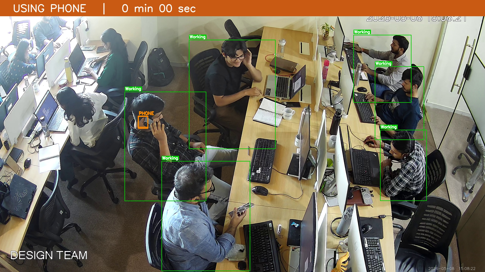
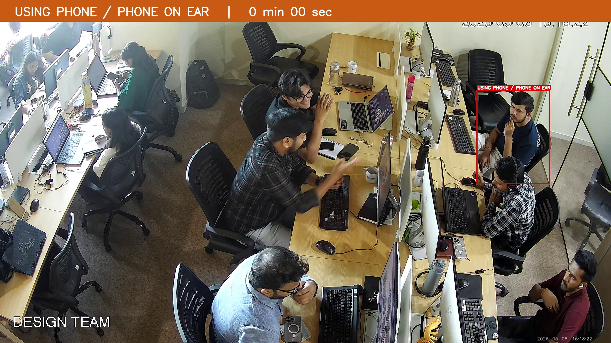
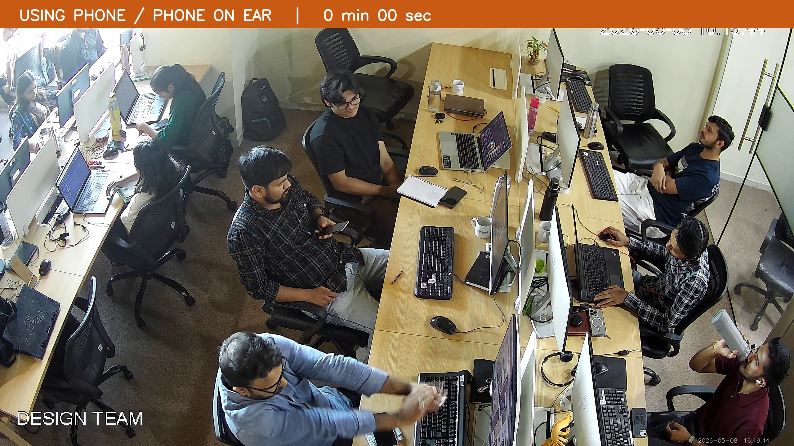
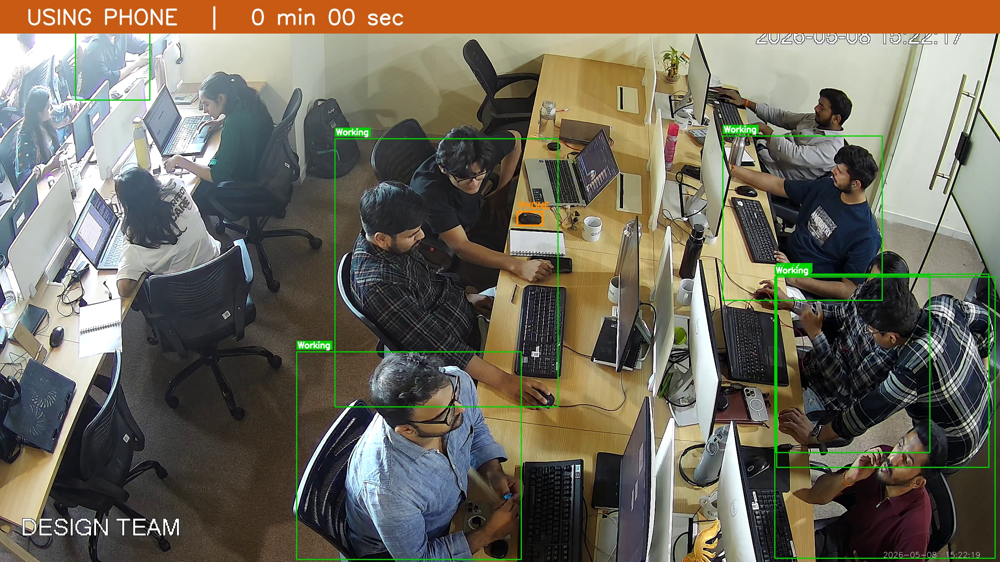

# 🎯 Employee Monitoring System

<div align="center">


**Real-time AI-powered CCTV employee behaviour monitoring via RTSP stream.**  
Detects phone usage, sleeping, time-wasting, and absent employees — with annotated photo evidence and optional AI descriptions.

</div>

---

## 📸 Live Detection Screenshots

<table>
  <tr>
    <td align="center">
      
      <br/><b>Phone Detection</b> — person bounding boxes + PHONE label
    </td>
    <td align="center">
      
      <br/><b>Phone on Ear</b> — wrist-to-ear proximity detection
    </td>
  </tr>
  <tr>
    <td align="center">
      
      <br/><b>Multi-person Tracking</b> — ByteTrack IDs + head yaw overlay
    </td>
    <td align="center">
      
      <br/><b>Alert Banner</b> — timestamped annotated evidence photo
    </td>
  </tr>
</table>

---

## ✨ Features

| Feature | Detail |
|---|---|
| **Phone Usage Detection** | Detects held phone AND phone-on-ear (wrist-to-ear proximity via pose) |
| **Sleeping Detection** | 2-of-3 signal: head-down pose + face invisible + motion stillness |
| **Time Wasting** | Standing, not facing screen (head yaw > ±40°), or leaning back |
| **Not in Seat** | Empty chair detection (COCO class 56) + ByteTrack disappearance |
| **Evidence Photos** | Annotated JPEG saved per alert with coloured bounding boxes + banner |
| **AI Descriptions** | Optional Ollama (LLaVA) natural-language description per alert |
| **False Positive Reduction** | `EvidenceAccumulator` — temporal voting over 6–10 frames before confirming |
| **GPU Acceleration** | Auto-detects CUDA; falls back to CPU |
| **Multi-person** | ByteTrack persistent IDs — tracks multiple employees simultaneously |

---

## 🏗️ Architecture

The system runs **7 parallel workers**, each on its own thread, sharing state through a thread-safe `SharedState` object.

```
RTSP Camera Stream
       │
  CameraThread  ──►  SharedState (frame buffer)
                            │
        ┌───────────────────┼───────────────────┐
        ▼                   ▼                   ▼
  TrackWorker         PhoneWorker          PoseWorker
  (ByteTrack +        (YOLOv8 crop +       (YOLOv8-Pose
   Chair detect)       aspect-ratio         sleeping /
                       validation)          looking-away /
                                            head yaw)
        ▼                   ▼                   ▼
  MotionWorker        FaceWorker         HeadPoseWorker
  (pixel diff         (InsightFace        (InsightFace
   stillness)          presence)           aspect yaw)
                            │
                     BehaviorEngine
                     (EvidenceAccumulators
                      + alert thresholds
                      + photo + log)
```

### Detection Pipeline

```
Raw YOLO detection
      │
EvidenceAccumulator (rolling window, ≥ N/M frames must be positive)
      │
Behavior Timer (SLEEPING ≥ 120 s, ABSENT ≥ 600 s, TIMEWASTE ≥ 600 s)
      │
fire_alert() → annotated photo + log line + optional Ollama description
```

---

## 📋 Requirements

- Python 3.8+
- NVIDIA GPU (recommended) or CPU
- RTSP-capable IP camera (Dahua or Hikvision tested)
- [Ollama](https://ollama.ai) + `llava` model *(optional — for AI descriptions)*

---

## 🚀 Installation

```bash
# 1. Clone the repository
git clone https://github.com/bhaskarbarot/Employees_Monitoring_System.git
cd Employees_Monitoring_System

# 2. Install Python dependencies
pip install -r requirements.txt

# 3. Download YOLOv8 model weights (auto-downloaded on first run, or manually)
#    Place in the project root:
#      yolov8n.pt       — person tracking + chair detection
#      yolov8n-pose.pt  — pose estimation
#      yolov8s.pt       — (optional, higher accuracy)
#    Download: https://github.com/ultralytics/assets/releases

# 4. (Optional) Install InsightFace for enhanced face/head-pose detection
pip install insightface onnxruntime-gpu   # GPU
# pip install insightface onnxruntime     # CPU only

# 5. (Optional) Set up Ollama for AI-generated alert descriptions
#    Install Ollama: https://ollama.ai
ollama pull llava
```

---

## ⚙️ Configuration

Copy `.env.example` to `.env` and fill in your camera details:

```bash
cp .env.example .env
```

```env
# Camera
CAMERA_IP=192.168.1.100
CAMERA_USER=admin
CAMERA_PASS=your_password
CAMERA_PORT=554
CAMERA_CHANNEL=1
CAMERA_TYPE=dahua        # dahua | hikvision

# Alert thresholds
SLEEP_THRESHOLD_SEC=120      # 2 min before SLEEPING alert fires
ABSENT_THRESHOLD_SEC=600     # 10 min before NOT_IN_SEAT alert fires
TIMEWASTE_THRESHOLD_SEC=600  # 10 min before TIME_WASTING alert fires
PHONE_COOLDOWN_SEC=30        # gap between repeated phone alerts

# Optional Ollama AI descriptions
USE_OLLAMA=true
OLLAMA_MODEL=llava:latest
```

**Camera RTSP path examples:**

| Brand | Auto-built path |
|---|---|
| Dahua | `rtsp://user:pass@IP:554/cam/realmonitor?channel=2&subtype=0` |
| Hikvision | `rtsp://user:pass@IP:554/Streaming/Channels/201` |
| Custom | Set `CAMERA_RTSP_PATH=/your/custom/path` |

---

## ▶️ Usage

```bash
python monitor.py
```

The live window opens showing:
- **Green box** — person detected, working normally
- **Red box** — PHONE / SLEEPING violation
- **Yellow box** — TIME WASTING
- **Orange box** — phone object bounding box
- **Status bar** — real-time counts of persons, phones, alerts, tracks

Press **`Q`** to quit.

---

## 📂 Project Structure

```
Employees_Monitoring_System/
│
├── monitor.py          # Main entry point — workers, annotation, live window
├── rules.py            # Alert handler — photo annotation, log writing, Ollama
├── requirements.txt    # Python dependencies
├── .env.example        # Environment variable template (copy → .env)
│
└── logs/
    ├── logs.txt        # Alert log (timestamp, event, duration, description)
    └── photos/         # Annotated alert evidence images
        ├── PHONE_USAGE_YYYYMMDD_HHMMSS.jpg
        ├── SLEEPING_YYYYMMDD_HHMMSS.jpg
        ├── NOT_IN_SEAT_YYYYMMDD_HHMMSS.jpg
        └── TIME_WASTING_YYYYMMDD_HHMMSS.jpg
```

---

## 📊 Alert Types

| Alert | Trigger | Evidence |
|---|---|---|
| `PHONE_USAGE` | Phone detected in hand **OR** wrist near ear, confirmed over 6 frames | Annotated photo with orange phone bbox |
| `SLEEPING` | 2-of-3: head below shoulders + face hidden + motionless ≥ 60 s, sustained ≥ 2 min | Annotated photo with blue banner |
| `NOT_IN_SEAT` | Track disappears OR empty chair detected ≥ 10 min | Last-known-frame photo |
| `TIME_WASTING` | Standing, head yaw > 40°, or leaning back ≥ 10 min | Annotated photo with green banner |

### Sample Log Output

```
[2026-05-08 15:08:22]  [PHONE_USAGE]  0m 00s  —  The employee is using their phone to capture an image of another employee using their laptop.  |  photo: logs/photos/PHONE_USAGE_20260508_150822.jpg
[2026-05-08 15:47:45]  [SLEEPING]     2m 00s  —  The employee appears to be sleeping, suggesting a long day at work.  |  photo: logs/photos/SLEEPING_20260508_154745.jpg
```

---

## 🧠 Key Research-Backed Design Decisions

**EvidenceAccumulator (temporal voting)**  
Requires a behaviour to appear in ≥ 65–80 % of the last 6–10 frames before confirming. Eliminates single-frame false positives from motion blur or partial occlusion.

**Phone validation (aspect-ratio + size + position filter)**  
A detected "phone" must be portrait-oriented (aspect 1.3–5.0), plausibly sized (0.03%–4% of frame), and positioned in the person's hand zone (20%–85% of their bounding-box height). Filters out mice, keyboards, and background objects.

**Head-yaw from nose-ear geometry**  
No MediaPipe dependency — yaw is estimated from the lateral offset of the nose between both ears. Ear visibility asymmetry (one ear hidden) flags a profile view directly.

**2-of-3 sleeping signals**  
Nose below shoulder midpoint AND face invisible AND pixel-diff stillness > 60 s. Any two of three must be true simultaneously, preventing false positives from leaning forward briefly.

---

## 📦 Dependencies

```
ultralytics>=8.0.0      # YOLOv8 detection + pose + ByteTrack
opencv-python>=4.8.0    # Video capture, annotation, display
python-dotenv>=1.0.0    # .env config loading
numpy>=1.24.0           # Array ops
requests>=2.31.0        # Ollama API calls (optional)
insightface             # Face detection / head pose (optional)
```

---

## 📄 License

MIT License — see [LICENSE](LICENSE) for details.

---

<div align="center">
Built with YOLOv8 · ByteTrack · OpenCV · InsightFace · Ollama
</div>
